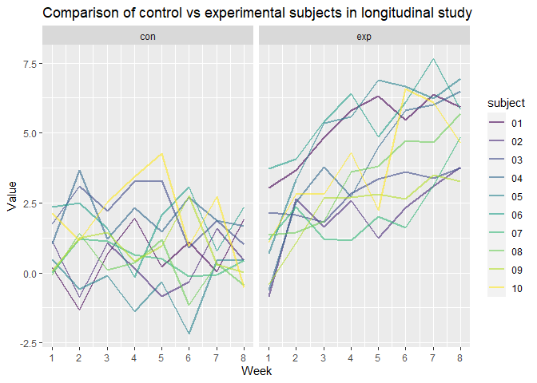

P8105_HW5_ah4028
================
Austin Hsin
2023-11-14

## Problem 2

``` r
file_names = list.files(path = "./data/study", full.names = TRUE) #list of all csv file names

study_import = function(path) { #creating function to import and tidy csv files
  
  df =
  read_csv(path) |>
    mutate(
      ID = path #creating ID variable from path name
    ) |>
    separate(ID, into = c("folder", "arm", "a", "subject", "csv"), sep = c(13, 16, 17, 19)) |> #separating ID into relevant sections
    arrange(arm, subject) |> #arranging by study arm and subject number
  pivot_longer(week_1:week_8,
               names_to = "Week",
               values_to = "Value") |> #pivoting original csv variables into `Week` and `Value`
     separate(Week, into = c("W", "Week_Num"), sep="_") |> #separating `Week` to obtain week number
    select(-folder, -a, -csv, -W) #removing non-pertinent variables
}

study_df_tidy = map(file_names, study_import) |>
  bind_rows() #merging all resulting files
```

Now, we can plot the results of the study per subject, separated by
control(`con`) vs experimental(`exp`) over duration of the study.

``` r
study_df_tidy |> 
  ggplot(aes(x = as.numeric(Week_Num), y = Value, color = subject)) +
  facet_grid(~arm) + #separate control vs experimental arm
   geom_line(aes(color = subject), alpha = 0.6, linewidth = 0.9) +
  labs(title = "Comparison of control vs experimental subjects in longitudinal study", x = "Week") + #title and x axis label
  scale_x_continuous(breaks = c(1, 2, 3, 4, 5, 6, 7, 8)) #ensuring week 1 through 8
```

<!-- -->

From the plot, we can see that the experimental group experienced larger
increases in value over the eight weeks while the control group values
stayed relatively stable. The experimental group had a variety of
subjects who had large increases in value at varying points, all of
which who eventually ended higher than their starting value. The control
group on the other hand, tended to stay within similar bounds with less
extreme changes in value.
