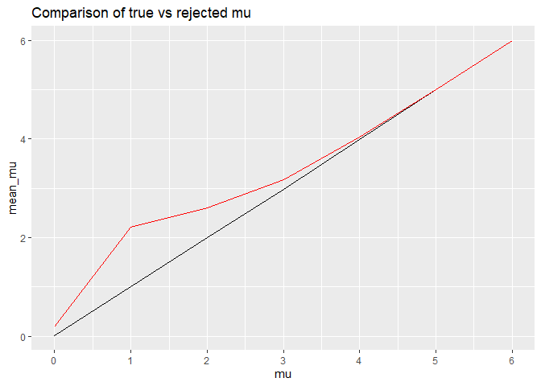

P8105_HW5_ah4028
================
Austin Hsin
2023-11-14

## Problem 2

``` r
file_names = list.files(path = "./data/study", full.names = TRUE) #list of all csv file names

study_import = function(path) { #creating function to import and tidy csv files
  
  df =
  read_csv(path) |>
    mutate(ID = path) |> #creating ID variable from path name
    separate(ID, into = c("folder", "arm", "a", "subject", "csv"), sep = c(13, 16, 17, 19)) |> #separating ID into relevant sections
    arrange(arm, subject) |> #arranging by study arm and subject number
  pivot_longer(week_1:week_8,
               names_to = "Week",
               values_to = "Value") |> #pivoting original csv variables into `Week` and `Value`
     separate(Week, into = c("W", "Week_Num"), sep="_") |> #separating `Week` to obtain week number
    select(-folder, -a, -csv, -W) #removing non-pertinent variables
}

study_df_tidy = map(file_names, study_import) |>
  bind_rows() #merging all resulting files
```

Now, we can plot the results of the study per subject, separated by
control(`con`) vs experimental(`exp`) over duration of the study.

``` r
study_df_tidy |> 
  ggplot(aes(x = as.numeric(Week_Num), y = Value, color = subject)) +
  facet_grid(~arm) + #separate control vs experimental arm
   geom_line(aes(color = subject), alpha = 0.6, linewidth = 0.9) +
  labs(title = "Comparison of control vs experimental subjects in longitudinal study", x = "Week") + #title and x axis label
  scale_x_continuous(breaks = c(1, 2, 3, 4, 5, 6, 7, 8)) #ensuring week 1 through 8
```

<!-- -->

From the plot, we can see that the experimental group experienced larger
increases in value over the eight weeks while the control group values
stayed relatively stable. The experimental group had a variety of
subjects who had large increases in value at varying points, all of
which who eventually ended higher than their starting value. The control
group on the other hand, tended to stay within similar bounds with less
extreme changes in value.

## Problem 3

First, we will create a function to calculate mu_hat and p_value given
specific bounds. Using this function, we will create simulated data set
of 5000 iterations using `map`.

``` r
sim_function= function(mu) {
  
  data = tibble(
    x = rnorm(n = 30, mean = mu, sd = 5) #specific bounds
  )
  
  output = data |> 
    t.test() |> 
    broom::tidy() |>
    select(estimate, p.value) |>
    rename(mu_hat = estimate, p_val = p.value) #renaming estimate and p.value from t.test
}

sim_results = expand_grid(
  mu_df = c(0,1,2,3,4,5,6), #repeating for mu = 1 - 6
  iteration = 1:500) |> #for shorter knit times in meanwhile
  mutate(
    estimate = map(mu_df, sim_function)) |>
  unnest(estimate) 
```

Next, we will plot the results of our simulation to show the proportion
of rejected, or the power of the test.

``` r
sim_results |>
  group_by(mu_df) |>
  summarize(
    reject = sum(p_val < 0.05),
    proportion = reject/500) |>
  ggplot(aes(x = mu_df, y = proportion)) + 
  geom_line(alpha = 0.6, linewidth = 0.9) + 
  scale_x_continuous(breaks = seq(0, 6, 1)) + #ensuring all mu values are shown
  labs(title = "Simulation of power, iteration = 5000", x = "mu")
```

<!-- -->

From the plot of power, we can see that as effect size, or the
proportion rejected, increases, power increases. This is because we
increase effect size, we have a greater overlap between the mean of null
and alternative distributions such that we have a increased chance to
reject the null.

Finally, we will separate the dataset into proportion of accepted true
values and rejected values of mu.

``` r
#proportion accepted true value mu
accept_df = sim_results |>
  group_by(mu_df) |>
  summarize(mean_mu = mean(mu_hat))

#proportion rejected value mu
reject_df = sim_results |>
  filter(p_val < 0.05) |>
  group_by(mu_df) |>
  summarize(mean_mu = mean(mu_hat))

ggplot(accept_df, aes(x = mu_df, y = mean_mu)) +
  geom_line() +
  geom_line(data = reject_df, color = "red")
```

<!-- -->
